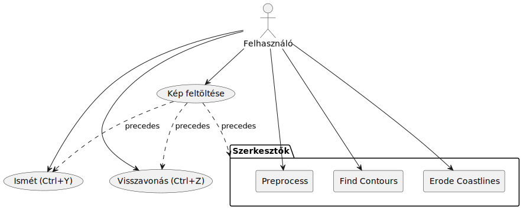
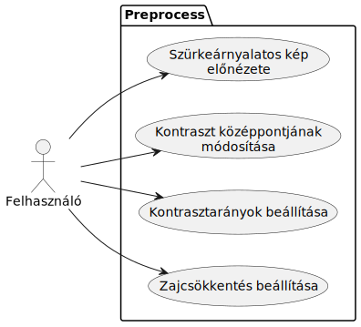
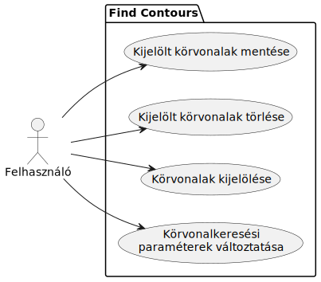
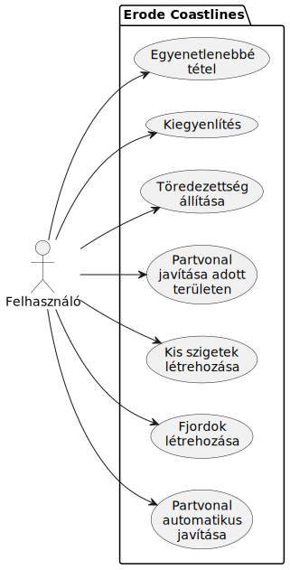

## Use cases

</img>
</img>
</img>
</img>

## User Stories

<link href="documentation/us_style.css" rel="stylesheet"/>

### Képfeltöltés

<table>
    <tr><td>GIVEN</td><td>Még nincs feltöltött kép </td></tr>
    <tr><td>WHEN</td><td>A felhasználó feltölt egy képet </td></tr>
    <tr><td>THEN</td><td>A weboldal minden szerkesztőt megjelenít, </td></tr>
    <tr><td>AND</td><td>minden állítható értéket alapértelmezettre állít be </td></tr>

</table>

### Szerkesztők Általánosan

<table>
    <tr><td>GIVEN</td><td>A szerkesztőben már van egy feltöltött kép </td></tr>
    <tr><td>WHEN</td><td>A felhasználó átállítja bármely tulajdonságot a szerkesztőben </td></tr>
    <tr><td>THEN</td><td>A szerkesztő előnézete az új paramétereknek megfelelően azonnal változik </td></tr>
</table>

<table>
    <tr><td>GIVEN</td><td>A szerkesztőben már van egy feltöltött kép </td></tr>
    <tr><td>WHEN</td><td>A felhasználó új képet próbál feltölteni </td></tr>
    <tr><td>THEN</td><td>A weboldal figyelmezteti, hogy az eddigi változtatásai el fognak veszni </td></tr>
    <tr><td>AND</td><td>lehetőséget kínál a művelet megszakítására, illetve új kép feltöltésére </td></tr>
</table>

<table>
    <tr><td>GIVEN</td><td>A szerkesztőben már van egy feltöltött kép </td></tr>
    <tr><td>WHEN</td><td>A felhasználó olyan értéket próbál megadni a szerkesztőnek, amellyel nem lehetséges képet alkotni </td></tr>
    <tr><td>THEN</td><td>Ahol lehet, a weboldal ne engedélyezze ilyen értékek megadását, különben jelezzen hibaüzenettel </td></tr>
</table>

<table>
    <tr><td>GIVEN</td><td>A szerkesztőben már van egy feltöltött kép </td></tr>
    <tr><td>AND</td><td>A felhasználó már létrehozott valamilyen módosítást ezen </td></tr>
    <tr><td>WHEN</td><td>A felhasználó megnyomja a 'Ctrl+Z' kombinációt </td></tr>
    <tr><td>THEN</td><td>A képen tett legutóbbi változtatás legyen visszafordítva, </td></tr>
    <tr><td>AND</td><td>ezt tükrözzék a szerkesztőben megjelenő eszközök illetve paraméterek is (amennyiben ez releváns) </td></tr>
</table>

<table>
    <tr><td>GIVEN</td><td>A szerkesztőben már van egy feltöltött kép </td></tr>
    <tr><td>AND</td><td>A felhasználó már létrehozott valamilyen módosítást ezen, amelyet aztán visszavont </td></tr>
    <tr><td>WHEN</td><td>A felhasználó megnyomja a 'Ctrl+Y' kombinációt </td></tr>
    <tr><td>THEN</td><td>A képen tett legutóbb visszavont változtatás lépjen ismét életbe, </td></tr>
    <tr><td>AND</td><td>ezt tükrözzék a szerkesztőben megjelenő eszközök illetve paraméterek is (amennyiben ez releváns) </td></tr>
</table>

### Második Szerkesztő (Körvonalak keresése)

<table>
    <tr><td>GIVEN</td><td>Van feltöltött kép és a második szerkesztő van megjelenítve </td></tr>
    <tr><td>WHEN</td><td>A felhasználó rákattint a megjelenített képre </td></tr>
    <tr><td>THEN</td><td>A kattintáshoz legközelebb lévő (bizonyos területen belüli) körvonal legyen kiemelve </td></tr>
    <tr><td>AND</td><td>az előző kijelölés szűnjön meg </td></tr>
</table>

<table>
    <tr><td>GIVEN</td><td>Van feltöltött kép és a második szerkesztő van megjelenítve </td></tr>
    <tr><td>WHEN</td><td>A felhasználó rákattint a megjelenített képre miközben lenyomva tartja a 'Ctrl' billentyűt </td></tr>
    <tr><td>THEN</td><td>A kattintáshoz legközelebb lévő (bizonyos területen belüli) körvonal legyen kiemelve </td></tr>
    <tr><td>AND</td><td>az eddigi kijelölés maradjon meg, az új körvonal pedig legyen hozzáadva </td></tr>
</table>

<table>
    <tr><td>GIVEN</td><td>Van feltöltött kép és a második szerkesztő van megjelenítve </td></tr>
    <tr><td>AND</td><td>legalább egy körvonal ki van jelölve </td></tr>
    <tr><td>WHEN</td><td>A felhasználó megnyomja a 'Delete' billentyűt, vagy az erre elhelyezett gombot </td></tr>
    <tr><td>THEN</td><td>Minden kijelölt körvonal tűnjön el a megjelenített képről, </td></tr>
    <tr><td>AND</td><td>ne jelenjen meg újra, amíg a körvonalkeresés paraméterei nem változnak. </td></tr>    
</table>

<table>
    <tr><td>GIVEN</td><td>Van feltöltött kép és a második szerkesztő van megjelenítve </td></tr>
    <tr><td>AND</td><td>legalább egy körvonal ki van jelölve </td></tr>
    <tr><td>WHEN</td><td>A felhasználó megnyomja az 'Enter' billentyűt, vagy az erre elhelyezett gombot </td></tr>
    <tr><td>THEN</td><td>Minden kijelölt körvonal legyen kiemelve a megjelenített képen, </td></tr>
    <tr><td>AND</td><td>legyen "elmentve:" kerüljön át a következő szerkesztőben lévő képre </td></tr>
    <tr><td>AND</td><td>maradjon kiemelve és elmentve még akkor is, ha a körvonalkeresés paraméterei változnak. </td></tr>
</table>

<table>
    <tr><td>GIVEN</td><td>Van feltöltött kép és a második szerkesztő van megjelenítve </td></tr>
    <tr><td>AND</td><td>legalább egy körvonal ki van jelölve </td></tr>
    <tr><td>WHEN</td><td>A felhasználó törölni próbál egy elmentett körvonalat </td></tr>
    <tr><td>THEN</td><td>Az oldal figyelmeztesse a felhasználót, </td></tr>
    <tr><td>AND</td><td>amennyiben tényleg törölni akarja, az törlődjön az elmentett körvonalak közül is. </td></tr>
</table>

<table>
    <tr><td>GIVEN</td><td>Van feltöltött kép és a második szerkesztő van megjelenítve </td></tr>
    <tr><td>AND</td><td>legalább egy körvonal ki van jelölve </td></tr>
    <tr><td>WHEN</td><td>A felhasználó egy (vagy több) mentett körvonalat újra "menteni" próbál </td></tr>
    <tr><td>THEN</td><td>A körvonalak kerüljenek le a mentett körvonalak listájáról. </td></tr>
</table>

#### További, egyelőre nehezen specifikálható követelmény:
- A felhasználónak legyen lehetősége egy adott körvonal "javítására"
    - gyakori, hogy egy körvonal nem teljesen zárt, noha emberi szemmel nézve könnyű lenne zárttá tenni
    - ezt a problémát lehessen orvosolni, lehetőség szerint minél könnyebben
- Alternatívaként lehet, hogy a "point_map_img" változóban tárolt kép, ami csak a körvonalak csúcspontjait tartalmazza, segítségünkre lehet
    - ugyanis itt is általában könnyű észrevenni, hogy mi a kívánt alakzat, bár algoritmust még nem találtam rá
    - valamilyen módon talán ezt is ki lehet majd használni, akár egy körvonalnál, akár az egész képnél

### Harmadik Szerkesztő (Partvonal javítása)

<table>
    <tr><td>GIVEN</td><td>A harmadik szerkesztőben lévő (bináris) kép nem egyszínű </td></tr>
    <tr><td>WHEN</td><td>A felhasználó kiválasztja az automatikus partvonal alakítás opciót </td></tr>
    <tr><td>THEN</td><td>A képen lévő körvonalak úgy változnak, hogy természetesebbnek tűnő partvonalat alkotnak </td></tr>
    <tr><td>AND</td><td>kellően nagy kép esetén a kialakított partvonal változatos (pl. fjordokat és szigeteket is tartalmaz). </td></tr>
</table>

<table>
    <tr><td>GIVEN</td><td>A felhasználó kiválasztotta az egyik partvonal alakító "ecsetet" </td></tr>
    <tr><td>AND</td><td>A szerkesztő előnézetében egy nem egyszínű részképet jelöl ki kattintással, vagy az egeret lenyomva tartva és mozgatva</td></tr>
    <tr><td>THEN</td><td>A részképen belüli partvonal az ecsetnek megfelelően változik, pl. fjord-szerű alakok, vagy kicsi szigetek jönnek létre. </td></tr>
</table>

<table>
    <tr><td>GIVEN</td><td>A szerkesztőben már van egy feltöltött kép </td></tr>
    <tr><td>WHEN</td><td>A felhasználó rányom a "Download" gombra</td></tr>
    <tr><td>THEN</td><td>Megnyílik egy párbeszédablak, amely lehetőséget ad a harmadik szerkesztőben lévő kép letöltésére </td></tr>
</table>
