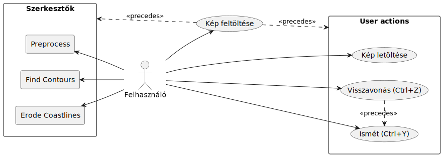
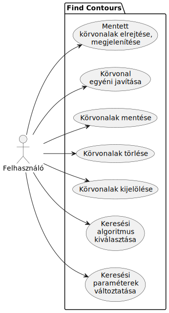

<h2>Nem funkcionális követelmények</h2>

### 1\. Hatékonyság

* Minimális terhelés egy mai átlagos felhasználású számítógép illetve okostelefon porcesszorára, memóriájára nézve
* Hálózati kapcsolatot igényel
* Gyors (< 1 mp) válaszidő egy mai átlagos számítógépen vagy okostelefonon, megfelelő internetkapcsolat mellett
* Általánosságban szinte azonnali (0.3 mp) válaszidő

### 2\. Megbízhatóság

* Szabványos használat esetén nem fordul elő hibajelenség, nem jelenik meg hibaüzenet
* A szoftver "bolondbiztos", a felhasználó nem tud elrontani semmit
* Hibás bevitelt a program hibajelenség nélkül képes kezelni - vagy kijavítja, vagy újat kér
* A lemezen nem tárol adatokat
* A program nem áll le váratlanul

### 3\. Biztonság:

* A program nem kezel érzékeny adatokat, így nem releváns

### 4\. Hordozhatóság

* Bármilyen mai böngészőprogram segítségével használható, eszköztől és operációs rendszertől függetlenül

### 5\. Felhasználhatóság

* Intuitív, könnyen kezelhető felhasználói felület
* A felület elrendezése alkalmazkodik a kijelző méretéhez, hogy az könnyen kezelhető maradjon
* A használathoz nem szükséges külön segédlet vagy leírás
* A program funkciói gyorsan elsajátíthatók az átlag felhasználó számára

### 6\. Környezeti

* Korszerű böngészőprogram és internetkapcsolat szükséges a futtatáshoz

### 7\. Működési:

* Általában rövid futási idő, várhatóan 20-30 perc
* Gyakori használat
* Felhasználók száma: 1

### 8\. Fejlesztési

* HTML, JavaScript
* OpenCV könyvtár használata
* Objektumorientált paradigma
* Unit testing
* GitHub
* Dokumentáció

<h2>Funkcionális követelmények</h2>

### Általánosan
* Lehessen képet feltölteni
* A szerkesztési folyamat során legyen lehetőség a végrehajtott műveletek
    * Visszavonására
    * Újbóli végrehasjtására (visszavonás ellenkezője)
    * Ez a funkcionalitás legyen biztosított legalább 5 lépés erejéig
* A különböző szerkesztők között tetszőlegesen váltani
    * A sorrend ne befolyásolja a program működését, vagy a végleges kimeneti képet 
    * (Elképzelhető, hogy ez a harmadik szerkesztő esetén nem megvalósítható)
* Minden szerkesztő alig észrevehető idő alatt dolgozza fel a képen tett változtatásokat
* Az előnézet dinamikusan változzon az adott szerkesztő paramétereinek megfelelően
* Lehessen a képet bármely szerkesztő szerinti állapotában letölteni
* A letöltött kép mindig az eredetivel megegyező felbontású legyen
    * Akár történt kicsinyítés a megjelenítés során, akár nem
    * Az eredeti kép itt az alaki transzformációk (vágás, forgatás, stb.) utáni állapotát jelentse

### Az első szerkesztőben
* A feltöltött képet lehessen:
    * Elforgatni
    * Kisebbre vágni, tetszőleges képarányban
    * Horizontálisan és vertikálisan megnyújtani
    * Torzítani
    * Tükrözni
* Illetve a következő effektusokat alkalmazni rá:
    * Kontrasztarány változtatása
    * Kontraszt középpontjának kiválasztása
    * Fehéregyensúly módosítása
    * Színek korrigálása
    * Zajcsökkentés
* A program nyújtson lehetőséget a szürkeárnyalatos filter ki- és bekapcsolására

### A második szerkesztőben
* A körvonalak keresését lehessen az alábbi módon finomhangolni:
    * Különböző keresési algoritmusok használatával, kombinálásával
    * Keresési paraméterek beállításával
    * Körvonalak törlésével
    * Körvonalak mentésével, hogy más paraméterek mellett is megmaradjanak
    * Törlés illetve mentés visszavonásával
    * Körvonalak egyéni javításával különböző algoritmusok segítségével
* Lehessen körvonalakat kijelölni
    * Kattintásra, vagy egér használata nélkül is
* A program jelenítse meg az utoljára kijelölt körvonalat egy külön vásznon
* Legyen lehetőség a mentett körvonalak megjelenítésére és elrejtésére

### A harmadik szerkesztőben
* A felhasználó számára álljanak rendelkezésre a következő funkciók:
    * A töredezettség növelése vagy csökkentése, az általános alakzat megtartása mellett 
    * A partvonal automatikus alakítása, természetessé, változatossá tétele
    * A kép egy kijelölt részén a partvonal:
        * Fjordokkal való kibővítése
        * Apró szigetekkel való körbevétele
        * Apró szigetekké való szétdarabolása
        * Kiegyenlítése/Elsimítása
        * Egyenetlenebbé tétele

<h2>Felhasználói eset diagramok</h2>

<h2>Felhasználói történetek</h2>

<link href="documentation/docu_style.css" rel="stylesheet"/>

### Képfeltöltés

<table>
    <tr><td>GIVEN</td><td>Még nincs feltöltött kép </td></tr>
    <tr><td>WHEN</td><td>A felhasználó feltölt egy képet </td></tr>
    <tr><td>THEN</td><td>A weboldal minden szerkesztőt megjelenít, </td></tr>
    <tr><td>AND</td><td>minden állítható értéket alapértelmezettre állít be </td></tr>

</table>

### Szerkesztők általánosan

<table>
    <tr><td>GIVEN</td><td>A szerkesztőben már van egy feltöltött kép </td></tr>
    <tr><td>WHEN</td><td>A felhasználó átállítja bármely tulajdonságot a szerkesztőben </td></tr>
    <tr><td>THEN</td><td>A szerkesztő előnézete az új paramétereknek megfelelően azonnal változik </td></tr>
</table>

<table>
    <tr><td>GIVEN</td><td>A szerkesztőben már van egy feltöltött kép </td></tr>
    <tr><td>WHEN</td><td>A felhasználó új képet próbál feltölteni </td></tr>
    <tr><td>THEN</td><td>A weboldal figyelmezteti, hogy az eddigi változtatásai el fognak veszni </td></tr>
    <tr><td>AND</td><td>lehetőséget kínál a művelet megszakítására, illetve új kép feltöltésére </td></tr>
</table>

<table>
    <tr><td>GIVEN</td><td>A szerkesztőben már van egy feltöltött kép </td></tr>
    <tr><td>WHEN</td><td>A felhasználó olyan értéket próbál megadni a szerkesztőnek, amellyel nem lehetséges képet alkotni </td></tr>
    <tr><td>THEN</td><td>Ahol lehet, a weboldal ne engedélyezze ilyen értékek megadását, különben jelezzen hibaüzenettel </td></tr>
</table>

<table>
    <tr><td>GIVEN</td><td>A szerkesztőben már van egy feltöltött kép </td></tr>
    <tr><td>AND</td><td>A felhasználó már létrehozott valamilyen módosítást ezen </td></tr>
    <tr><td>WHEN</td><td>A felhasználó megnyomja a 'Ctrl+Z' kombinációt </td></tr>
    <tr><td>THEN</td><td>A képen tett legutóbbi változtatás legyen visszafordítva, </td></tr>
    <tr><td>AND</td><td>ezt tükrözzék a szerkesztőben megjelenő eszközök illetve paraméterek is (amennyiben ez releváns) </td></tr>
</table>

<table>
    <tr><td>GIVEN</td><td>A szerkesztőben már van egy feltöltött kép </td></tr>
    <tr><td>AND</td><td>A felhasználó már létrehozott valamilyen módosítást ezen, amelyet aztán visszavont </td></tr>
    <tr><td>WHEN</td><td>A felhasználó megnyomja a 'Ctrl+Y' kombinációt </td></tr>
    <tr><td>THEN</td><td>A képen tett legutóbb visszavont változtatás lépjen ismét életbe, </td></tr>
    <tr><td>AND</td><td>ezt tükrözzék a szerkesztőben megjelenő eszközök illetve paraméterek is (amennyiben ez releváns) </td></tr>
</table>

### Második szerkesztő (Körvonalak keresése)

<table>
    <tr><td>GIVEN</td><td>Van feltöltött kép és a második szerkesztő van megjelenítve </td></tr>
    <tr><td>WHEN</td><td>A felhasználó rákattint a megjelenített képre </td></tr>
    <tr><td>THEN</td><td>A kattintáshoz legközelebb lévő (bizonyos területen belüli) körvonal legyen kiemelve </td></tr>
    <tr><td>AND</td><td>az előző kijelölés szűnjön meg </td></tr>
</table>

<table>
    <tr><td>GIVEN</td><td>Van feltöltött kép és a második szerkesztő van megjelenítve </td></tr>
    <tr><td>WHEN</td><td>A felhasználó rákattint a megjelenített képre miközben lenyomva tartja a 'Ctrl' billentyűt </td></tr>
    <tr><td>THEN</td><td>A kattintáshoz legközelebb lévő (bizonyos területen belüli) körvonal legyen kiemelve </td></tr>
    <tr><td>AND</td><td>az eddigi kijelölés maradjon meg, az új körvonal pedig legyen hozzáadva </td></tr>
</table>

<table>
    <tr><td>GIVEN</td><td>Van feltöltött kép és a második szerkesztő van megjelenítve </td></tr>
    <tr><td>AND</td><td>legalább egy körvonal ki van jelölve </td></tr>
    <tr><td>WHEN</td><td>A felhasználó megnyomja a 'Delete' billentyűt, vagy az erre elhelyezett gombot </td></tr>
    <tr><td>THEN</td><td>Minden kijelölt körvonal tűnjön el a megjelenített képről, </td></tr>
    <tr><td>AND</td><td>ne jelenjen meg újra, amíg a körvonalkeresés paraméterei nem változnak. </td></tr>    
</table>

<table>
    <tr><td>GIVEN</td><td>Van feltöltött kép és a második szerkesztő van megjelenítve </td></tr>
    <tr><td>AND</td><td>legalább egy körvonal ki van jelölve </td></tr>
    <tr><td>WHEN</td><td>A felhasználó megnyomja az 'Enter' billentyűt, vagy az erre elhelyezett gombot </td></tr>
    <tr><td>THEN</td><td>Minden kijelölt körvonal legyen kiemelve a megjelenített képen, </td></tr>
    <tr><td>AND</td><td>legyen "elmentve:" kerüljön át a következő szerkesztőben lévő képre </td></tr>
    <tr><td>AND</td><td>maradjon kiemelve és elmentve még akkor is, ha a körvonalkeresés paraméterei változnak. </td></tr>
</table>

<table>
    <tr><td>GIVEN</td><td>Van feltöltött kép és a második szerkesztő van megjelenítve </td></tr>
    <tr><td>AND</td><td>legalább egy körvonal ki van jelölve </td></tr>
    <tr><td>WHEN</td><td>A felhasználó törölni próbál egy elmentett körvonalat </td></tr>
    <tr><td>THEN</td><td>Az oldal figyelmeztesse a felhasználót, </td></tr>
    <tr><td>AND</td><td>amennyiben tényleg törölni akarja, az törlődjön az elmentett körvonalak közül is. </td></tr>
</table>

<table>
    <tr><td>GIVEN</td><td>Van feltöltött kép és a második szerkesztő van megjelenítve </td></tr>
    <tr><td>AND</td><td>legalább egy körvonal ki van jelölve </td></tr>
    <tr><td>WHEN</td><td>A felhasználó egy (vagy több) mentett körvonalat újra "menteni" próbál </td></tr>
    <tr><td>THEN</td><td>A körvonalak kerüljenek le a mentett körvonalak listájáról. </td></tr>
</table>

#### További, egyelőre nehezen specifikálható követelmény:
- A felhasználónak legyen lehetősége egy adott körvonal "javítására"
    - gyakori, hogy egy körvonal nem teljesen zárt, noha emberi szemmel nézve könnyű lenne zárttá tenni
    - ezt a problémát lehessen orvosolni, lehetőség szerint minél könnyebben
- Alternatívaként lehet, hogy a "point_map_img" változóban tárolt kép, ami csak a körvonalak csúcspontjait tartalmazza, segítségünkre lehet
    - ugyanis itt is általában könnyű észrevenni, hogy mi a kívánt alakzat, bár algoritmust még nem találtam rá
    - valamilyen módon talán ezt is ki lehet majd használni, akár egy körvonalnál, akár az egész képnél

### Harmadik szerkesztő (Partvonal javítása)

<table>
    <tr><td>GIVEN</td><td>A harmadik szerkesztőben lévő (bináris) kép nem egyszínű </td></tr>
    <tr><td>WHEN</td><td>A felhasználó kiválasztja az automatikus partvonal alakítás opciót </td></tr>
    <tr><td>THEN</td><td>A képen lévő körvonalak úgy változnak, hogy természetesebbnek tűnő partvonalat alkotnak </td></tr>
    <tr><td>AND</td><td>kellően nagy kép esetén a kialakított partvonal változatos (pl. fjordokat és szigeteket is tartalmaz). </td></tr>
</table>

<table>
    <tr><td>GIVEN</td><td>A felhasználó kiválasztotta az egyik partvonal alakító "ecsetet" </td></tr>
    <tr><td>AND</td><td>A szerkesztő előnézetében egy nem egyszínű részképet jelöl ki kattintással, vagy az egeret lenyomva tartva és mozgatva</td></tr>
    <tr><td>THEN</td><td>A részképen belüli partvonal az ecsetnek megfelelően változik, pl. fjord-szerű alakok, vagy kicsi szigetek jönnek létre. </td></tr>
</table>

<table>
    <tr><td>GIVEN</td><td>A szerkesztőben már van egy feltöltött kép </td></tr>
    <tr><td>WHEN</td><td>A felhasználó rányom a "Download" gombra</td></tr>
    <tr><td>THEN</td><td>Megnyílik egy párbeszédablak, amely lehetőséget ad a harmadik szerkesztőben lévő kép letöltésére </td></tr>
</table>
